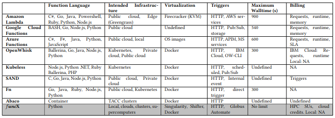
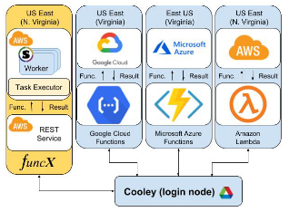
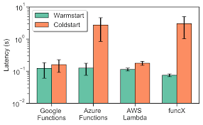
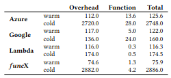

# [Serverless Supercomputing: High Performance Function as a Service for Science](https://arxiv.org/pdf/1908.04907.pdf)

## By: Ryand Chard, Tyler J. Skluzacek, Zhuozhao Li, et al.

They propose **funcX** to create a high performance function-as-a-service (FaaS) platform on existing infrastructure including clouds, clusters, and supercomputers. After describe its options and configurations, they compare it with other commercial, open source, and academic platforms so they can compare their configurations and services (Amazon Lambda, Google Cloud Functions, Azure Functions, OpenWhisk, Kubeless, SAND, Fn, and Abaco). Finally, they present a latency compartive table between Azure, Google, Lambda and *funcX*. 

## FaaS

FaaS platforms have proved wildly successful in industry as a way to reduce costs and the need to manage infrastructure. Here they present a brief survey of FaaS platforms, summarized in a rear table. They broadly categorize platforms as commercial, open source, or academic, and further compare them based on the following categories. 

- Languages: The programming languages that can be used to define functions.
- Infrastructure: Where the FaaS platform is deployed and where functions are executed, e.g., cloud, Kubernetes.
- Virtualization: The virtualization technology used to isolate and deploy functions.
- Triggers: How functions are invoked and whether specific event sources are supported.
- Walltime: How long functions are permitted to execute.
- Billing: What billing models are used to recoup costs.

## FuncX

In response to these challenges they have developed a flexible, scalable, and high-performance function execution platform, *funcX*, that adapts the powerful and flexible FaaS model to support science workloads, and in particular data and learning system workloads, across diverse research CI.

**funcX** leverages modern programming practices to allow researchers to register functions (implemented in Python) and then invoke those functions on supplied input JSON documents. *funcX* manages the deployment and execution of those functions on remote resources, provisioning resources, staging function code and
input documents, managing safe and secure execution sandboxes using containers, monitoring execution, and returning output documents to users. Functions are able to execute on any compute resource where *funcX* endpoint software is installed and a requesting user is authorized to access. *funcX* agents can turn any existing
resource (e.g., cloud, cluster, supercomputer, or container orchestration cluster) into a FaaS endpoint.

### Commercial Platforms
Most commercial cloud providers offer FaaS capabilities. Here they compare three platforms offered by Amazon, Microsoft, and Google.

- [Amazon Lambda](https://aws.amazon.com/lambda) pioneered the FaaS paradigm in 2014 and has since be used in many industry and academic use cases. Lambda is a hosted service that supports a multitude of function languages and trigger sources (Web interface, CLI, SDK, and other AWS services). Tight integration with the wider AWS ecosystem means Lambda functions can be associated with triggers from other AWS services, such as CloudWatch, S3, API gateways, SQS queues, and Step Functions. Functions are billed based on their memory allocation and for every 100ms execution time. Once defined, Lambda uses a custom virtualization technology built on KVM, called Firecracker to create lightweight micro-virtual machines. These microVMs then persist in a warmed state for five minutes and continue to serve requests. While Lambda is provided as a hosted service, functions can be deployed locally or to edge devices via the Greengrass IoT platform.
- [Google Cloud Functions](https://cloud.google.com/functions/) is differentiated by its tight coupling to Google Cloud Storage, Firebase mobile backends, and custom IoT configurations via Google’s globally distributed message bus (Cloud Pub/Sub). Like Lambda, Google Cloud Functions also support triggers from arbitrary HTTP webhooks. Further, users can trigger functions through a number of third party systems including GitHub, Slack, and Stripe. While Google Cloud functions apply a similar pricing model to Lambda, the model is slightly more expensive for high-volume, less computationally intensive tasks as Lambda has lower per-request costs after the first two million invocations (with similar compute duration costs).
- [Azure Functions](https://azure.microsoft.com/en-us/services/functions/) allow users to create functions in a native language through either the Web interface or the CLI. Functions are packaged and may be tested locally using a local web service before being uploaded to the Azure platform. Azure functions integrate
with other Azure products through triggers. Triggers are provided from CosmosDB, Blob storage, and Azure storage queues, in addition to custom HTTP and time-based triggers. Azure price-matches AWS for compute and storage (as of November 2018).

## Open Source Platforms

Open FaaS platforms resolve two of the key challenges to using FaaS for scientific workloads: they can be deployed on-premise and can be customized to meet the requirements of data-intensive workloads without any pricing models.

- [Apache OpenWhisk](http://openwhisk.apache.org/) is the most well-known open source FaaS platform. OpenWhisk is the basis of IBM Cloud Functions. OpenWhisk clearly defines an event-based programming model, consisting of Actions which are stateless, runnable functions, Triggers which are the types of events OpenWhisk may track, and Rules which associate one trigger with one action. OpenWhisk can be deployed locally as a service using a Kubernetes cluster. However, deploying OpenWhisk is non-trivial, requiring installation of dependencies and administrator access to the cluster.
- [Fn](http://fnproject.io/) is a powerful open-source software from Oracle that can be deployed on any Linux-based compute resource having administrator access to run Docker containers. Applications—or groups of functions—allow users to logically group functions to build runtime utilities (e.g., dependency downloads in custom Docker containers) and other resources (e.g., a trained machine learning model file) to support functions in the group. Moreover, Fn supports fine-grained logging and metrics, and is one of few open source FaaS platforms deployable on Windows. Fn can be deployed locally or on a Kubernetes cluster. In our experience, one can deploy a fully-functional Fn server in minutes.
- [Kubeless](https://kubeless.io/) is a native Kubernetes FaaS platform that takes advantage of built-in Kubernetes primitives. Kubeless uses Apache Kafka for messaging, provides a CLI that mirrors that of AWS Lambda, and supports fine-grained monitoring. Users can invoke functions via the CLI, HTTP, and via a Pub/Sub mechanism. Like Fn, Kubeless allows users to define function groups that share resources. Like OpenWhisk, Kubeless is reliant on Kubernetes and cannot be deployed on other resources.

## Academic Platforms

The success of FaaS in industry has spurred academic exploration of FaaS. Two systems that have resulted from that work are SAND and Actor Based Co(mputing)ntainers (Abaco).

- [SAND](https://www.usenix.org/system/files/conference/atc18/atc18-akkus.pdf) (Istemi Ekin Akkus, Ruichuan Chen, Ivica Rimac, Manuel Stein, Klaus Satzke, et al. 2018. SAND: Towards High-Performance Serverless Computing. In USENIX Annual Technical Conference. 923–935) is a lightweight, low-latency FaaS platform from Nokia Labs that provides application-level sandboxing and a hierarchical message bus. The authors state that they achieve a 43% speedup and a 22x latency reduction over Apache OpenWhisk in commonly-used image processing applications. Further, SAND provides support for function or grain chaining via user-submitted workflows. At the time of their writing, it appears that SAND does not support multi-tenancy, only having isolation at the application level. SAND is closed source and as far as they know cannot be downloaded and installed locally.
- [Abaco](https://tacc-cloud.readthedocs.io/projects/abaco/en/latest/) (Joe Stubbs, Rion Dooley, and Matthew Vaughn. 2017. Containers-as-a-service via the Actor Model. In 11th Gateway Computing Environments Conference.) supports functions written in a wide range of programming languages and supports automatic scaling. Abaco implements the Actor model in which an actor is an Abaco runtime mapped to a specific Docker image. Each actor executes in response to messages posted to its inbox. Moreover, Abaco provides fine-grained monitoring of container, state, and execution events and statistics. Abaco is deployable via Docker Compose.



## Comparison

They compare the latency for four differents platforms: Amazon Lambda, Google Cloud Functions, Microsoft Azure, and **funcX**.

### Latency

They compare it with commercial FaaS platforms by measuring the time required for single function invocations. They have created and deployed the same Python function on Amazon Lambda, Google Cloud Functions, Microsoft Azure Functions, and *funcX*. To minimize unnecessary overhead they use the same payload when invoking each function: the string “hello-world.” Each function simply prints and returns the string.

```
def hello_world(event):
    print(event)
    return event
```

Although each provider operates its own data centers, they attempt to standardize network latencies by placing functions in an available US East region (between South Carolina and Virginia). They deploy *funcX* service and endpoint on two AWS EC2 instances (m5.large) in the US East region. They use an HTTP trigger to invoke the function on each of the FaaS platforms. They then measure latency as the round-trip time to submit, execute, and return a result from the function. They submit all requests from the login node of Argonne National Laboratory’s Cooley cluster, in Chicago, IL (20.5 ms latency to the *funcX* service). The experiment configuration is shown:



For each FaaS service they compare the cold start time and warm start time. The cold start time aims to capture the scenario where a function is first executed and the function code and execution environment must be configured. To capture this in *funcX* they restart the service and measure the time taken to launch the first function. For the other services, they simply invoke functions every 10 minutes and 1 second (providers report maximum cache times of 10 minutes, 5 minutes, 5 minutes, for Google, Amazon, and Azure, respectively) in order to ensure that each function starts cold. They execute the cold start functions 40 times, and the warmed functions 2000 times. They report the mean completion time and standard deviation for each FaaS platform in the next figure.



They notice that Lambda, Google Functions, and Azure Functions exhibit warmed round trip times of 116ms, 122ms, and 126ms, respectively. *funcX* proves to be considerably faster, running warm functions in 76ms. They suspect this is due to *funcX*’s minimal overhead, as, for example, requests are sent directly to the *funcX* service rather than through elastic load balancers (e.g., AWS ELB for Lambda), and also likely incur fewer logging and resiliency overheads. When comparing cold start performance, they find that Lambda, Google Functions, Azure Functions, and *funcX* exhibit cold round trip times of 175ms, 160ms, 2748ms, and 2886ms respectively. Google and Lambda exhibit significantly lower cold start times, perhaps as a result of the simplicity of our function (which requires only standard Python libraries and therefore could be served on a standard container) or perhaps due to the low overhead of these proprietary container technologies. In the case of *funcX* this overhead is primarily due to the startup time of the container (see next table).



They next break down the latency of each function invocation for each FaaS service. Previous table shows the total time for warm and cold functions in terms of overhead and function execution time. For the closed-source, commercial FaaS systems we obtain function execution time from execution logs and compute overhead as any additional time spent invoking the function. As expected, overheads consume much of the invocation time. Somewhat surprisingly, they observe that Lambda has much faster function execution time for cold than for warm containers, perhaps as the result of the way Amazon reports usage.

## Conclusion

They show the different configuration and options for each FaaS platform available in commercial, open source and academic fields. They obtain a good comparison table, so here is posible to find the most who has the most programming language support, which is the maximum walltime or simply find which is the billing for every platform.

In all the paper, they show the best latency in each platform, implementing different configurations and testing with more than 20 times a cold start and 4000 time warm start in every platform, so they have a very precise and trustworthy table to check this latency performance.

Finally, this article is very interesting and is recommended as a reliable source of information on the following topics:

- Comparison FaaS alternative platforms (9 different alterntives).
- Latency comparison for Commercial platforms (Google Cloud Functions, Microsoft Ayure Functions, and AWS Lambda).
- Comparison in cold and warm startup for previous Commercial Platforms.