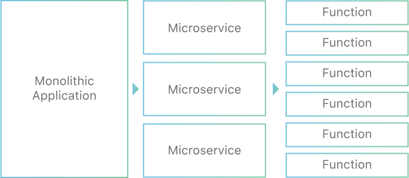

# [What is serverless computing? Real world examples](https://www.appdynamics.com/topics/what-is-serverless)

## Serverless Computing

Serverless Computing is an easily scalable, cost-effective, cloud-based infrastructure that allows enterprises to adopto cloud services by focusing their time and resources on writing, deploying, and optimiying code without the burden of provisioning or managing server instances.

Serverless architecture is largely based on a Functions as a Service (FaaS) model that allows cloud platforms to execute code without the need for fully provisioned infrastructure instances. FaaS, also known as Compute as a Service (CaaS), are stateless, server-side functions that are event-driven, scalable, and fully managed by cloud providers. 

AWS Lambda, Microsoft Azure Functions, Google Cloud Functions and IBM OpenWhisk are all well-known examples of serverless services offered by the cloud providers. 

The convenience and cost-saving benefits associated with on-demand auto-scaling resources, and only paying for services as they're needed, makes serverless frameworks an appealing option for DevOps teams and business stakeholders alike.

# [What is serverless computing? | Serverless definition](https://www.cloudflare.com/learning/serverless/what-is-serverless/)

Serverless computing is a method of providing backend services on an as-used basis. Servers are still used, but a company that gets backend services from a serverless vendor is charged based on usage, not a fixed amount of bandwidth or number of servers.

A serverless provider allows users to write and deploy code without the hassle of worrying about the underlying infrastructure. A company that gets backend services from a serverless vendor is charged based on their computation and do not have to reserve and pay for a fixed amount of bandwidth or number of servers, as the service is auto-scaling. Note that despite the name serverless, physical servers are still used but developers do not need to be aware of them.

In the early days of the web, anyone who wanted to build a web application had to own the physical hardware required to run a server, which is a cumbersome and expensive undertaking.

Then came cloud computing, where fixed numbers of servers or amounts of server space could be rented remotely. Developers and companies who rent these fixed units of server space generally over-purchase to ensure that a spike in traffic or activity will not exceed their monthly limits and break their applications. This means that much of the server space that gets paid for can go to waste. Cloud vendors have introduced auto-scaling models to address the issue, but even with auto-scaling an unwanted spike in activity, such as a DDoS Attack, could end up being very expensive.

Serverless computing allows developers to purchase backend services on a flexible ‘pay-as-you-go’ basis, meaning that developers only have to pay for the services they use. This is like switching from a cell phone data plan with a monthly fixed limit, to one that only charges for each byte of data that actually gets used.

## FaaS

FaaS allows developers to execute small pieces of code on the network edge. With FaaS, developers can build a modular architecture, making a codebase that is more scalable without having to spend resources on maintaining the underlying backend.

## What are the advantages of serverless computing?

- Lower costs - Serverless computing is generally very cost-effective, as traditional cloud providers of backend services (server allocation) often result in the user paying for unused space or idle CPU time.
- Simplified scalability - Developers using serverless architecture don’t have to worry about policies to scale up their code. The serverless vendor handles all of the scaling on demand.
- Simplified backend code - With FaaS, developers can create simple functions that independently perform a single purpose, like making an API call.
- Quicker turnaround - Serverless architecture can significantly cut time to market. Instead of needing a complicated deploy process to roll out bug fixes and new features, developers can add and modify code on a piecemeal basis.

## How does serverless compare to other cloud backend models?

A couple of technologies that are often conflated with serverless computing are Backend-as-a-Service and Platform-as-a-Service. Although they share similarities, these models do not necessarily meet the requirements of serverless.

- Backend-as-a-service (BaaS) is a service model where a cloud provider offers backend services such as data storage, so that developers can focus on writing front-end code. But while serverless applications are event-driven and run on the edge, BaaS applications may not meet either of these requirements.

- Platform-as-a-service (PaaS) is a model where developers essentially rent all the necessary tools to develop and deploy applications from a cloud provider, including things like operating systems and middleware. However PaaS applications are not as easily scalable as serverless applications. PaaS also don’t necessarily run on the edge and often have a noticeable startup delay that isn’t present in serverless applications.

- Infrastructure-as-a-service (IaaS) is a catchall term for cloud vendors hosting infrastructure on behalf of their customers. IaaS providers may offer serverless functionality, but the terms are not synonymous. 

## What next for serverless?

Serverless computing continues to evolve as serverless providers come up with solutions to overcome some of its drawbacks. One of these drawbacks is cold starts.

Typically when a particular serverless function has not been called in a while, the provider shuts down the function to save energy and avoid over-provisioning. The next time a user runs an application that calls that function, the serverless provider will have to spin it up fresh and start hosting that function again. This startup time adds significant latency, which is known as a ‘cold start’.

Once the function is up and running it will be served much more rapidly on subsequent requests (warm starts), but if the function is not requested again for a while, the function will once again go dormant. This means the next user to request that function will experience a cold start. Up until fairly recently, cold starts were considered a necessary trade-off of using serverless functions.

# [What is Function-as-a-Service (FaaS)?](https://www.cloudflare.com/learning/serverless/glossary/function-as-a-service-faas/)

Function-as-a-Service (FaaS) is a serverless way to execute modular pieces of code on the edge. FaaS lets developers write and update a piece of code on the fly, which can then be executed in response to an event, such as a user clicking on an element in a web application. This makes it easy to scale code and is a cost-efficient way to implement microservices.

## What are microservices?

If a web application were a work of visual art, using microservice architecture would be like making the art out of a collection of mosaic tiles. The artist can easily add, replace, and repair one tile at a time. Monolithic architecture would be like painting the entire work on a single piece of canvas.

This approach of building an application out of a set of modular components is known as microservice architecture. Dividing an application into microservices is appealing to developers because it means they can create and modify small pieces of code which can be easily implemented into their codebases. This is in contrast to monolithic architecture, in which all the code is interwoven into one large system. With large monolithic systems, even a minor changes to the application requires a hefty deploy process. FaaS eliminates this deploy complexity.

Using serverless code like FaaS, web developers can focus on writing application code, while the serverless provider takes care of server allocation and backend services.

## What are the advantages of using FaaS?

### Improved developer velocity

With FaaS, developers can spend more time writing application logic and less time worrying about servers and deploys. This typically means a much faster development turnaround.

### Built-in scalability

Since FaaS code is inherently scalable, developers don’t have to worry about creating contingencies for high traffic or heavy use. The serverless provider will handle all of the scaling concerns.

### Cost efficiency

Unlike traditional cloud providers, serverless FaaS providers do not charge their clients for idle computation time. Because of this, clients only pay for as much computation time as they use, and do not need to waste money over-provisioning cloud resources.

## What are the drawbacks of FaaS?

### Less system control

Having a third party manage part of the infrastructure makes it tough to understand the whole system and adds debugging challenges.

### More complexity required for testing

It can be very difficult to incorporate FaaS code into a local testing environment, making thorough testing of an application a more intensive task.

**Next ->** [FaaS platforms comparison](../faas_comparison/README.md)