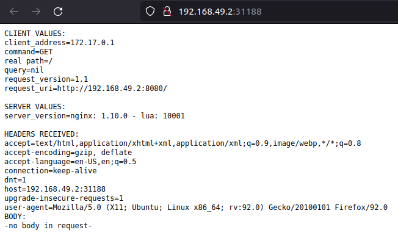
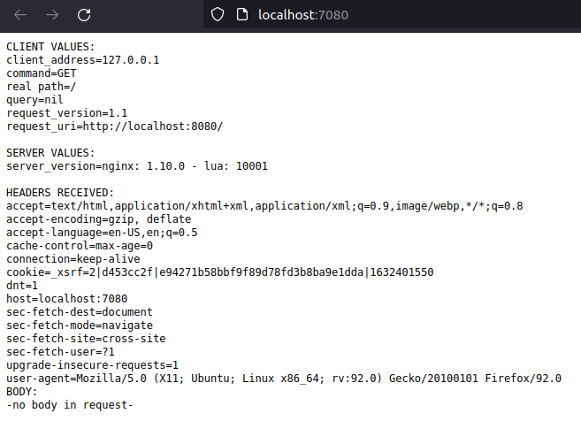
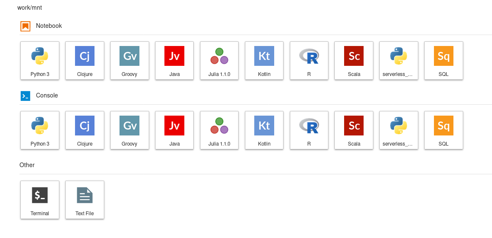

# [Serverless Notebook Using OpenFaaS](https://github.com/cmrfrd/serverless_notebooks)

### Getting Started
---

#### Requirements:

- [Minikube](https://github.com/kubernetes/minikube) version 0.30.0
- [Docker](https://docs.docker.com/install/) version 18.09.1

# Step 1: [Install Minikube](https://minikube.sigs.k8s.io/docs/start/)

To install the latest minikube stable release on x86-64 Linux using Debian package:

```
curl -LO https://storage.googleapis.com/minikube/releases/latest/minikube_latest_amd64.deb
sudo dpkg -i minikube_latest_amd64.deb
```

## 1. Start your cluster

From a terminal with administrator access (but not logged in as root), run:

```
minikube start
```

If minikube fails to start, see the drivers page for help setting up a compatible container or virtual-machine manager.

## 2. Interact with your cluster

If you already have kubectl installed, you can now use it to access your shiny new cluster:

```
kubectl get po -A
```

Alternatively, minikube can download the appropriate version of kubectl, if you don’t mind the double-dashes in the command-line:

```
minikube kubectl -- get po -A
```

Initially, some services such as the storage-provisioner, may not yet be in a Running state. This is a normal condition during cluster bring-up, and will resolve itself momentarily. For additional insight into your cluster state, minikube bundles the Kubernetes Dashboard, allowing you to get easily acclimated to your new environment:

```
minikube dashboard
```

## 3. Deploy applications

Create a sample deployment and expose it on port 8080:

```
kubectl create deployment hello-minikube --image=k8s.gcr.io/echoserver:1.4
kubectl expose deployment hello-minikube --type=NodePort --port=8080
```

It may take a moment, but your deployment will soon show up when you run:

```
kubectl get services hello-minikube
```

The easiest way to access this service is to let minikube launch a web browser for you:

```
minikube service hello-minikube
```



Alternatively, use kubectl to forward the port:

```
kubectl port-forward service/hello-minikube 7080:8080
```



## Step 2: [Install Docker](https://docs.docker.com/engine/install/ubuntu/)

### Set up repository

1. Update ```apt``` package index and install packages to allow ```apt``` to use repository over HTTPS:

```bash
$ sudo apt-get update
```

```
$ sudo apt-get install \
    apt-transport-https \
    ca-certificates \
    curl \
    gnupg \
    lsb-release
```

2. Add Docker's official GPG key:

```
$ curl -fsSL https://download.docker.com/linux/ubuntu/gpg | sudo gpg --dearmor -o /usr/share/keyrings/docker-archive-keyring.gpg
```

3. Use the following command to set up the *stable" repository:

```
$ echo \
  "deb [arch=amd64 signed-by=/usr/share/keyrings/docker-archive-keyring.gpg] https://download.docker.com/linux/ubuntu \
  $(lsb_release -cs) stable" | sudo tee /etc/apt/sources.list.d/docker.list > /dev/null
```

### Install Docker Engine

1. Update the apt package index, and install the latest version of Docker Engine and containerd, or go to the next step to install a specific version:

```
$ sudo apt-get update
$ sudo apt-get install docker-ce docker-ce-cli containerd.io
```

2. Verify that Docker Engine is installed correctly by running the ```hello-world``` image:

```
$ sudo docker run hello-world
```

**(Docker version: Docker version 20.10.8, build 3967b7d)**

## Step 3: [Install Docker Compose](https://docs.docker.com/compose/install/)

1. Run this command to download the current stable release of Docker Compose:

```
$ sudo curl -L "https://github.com/docker/compose/releases/download/1.29.2/docker-compose-$(uname -s)-$(uname -m)" -o /usr/local/bin/docker-compose
```

2. Apply executable permissions to the binary:

```
$ sudo chmod +x /usr/local/bin/docker-compose
```

3. Test the installation 

```
$ docker-compose --version
```

**(Docker Compose version: docker-compose version 1.29.2, build 5becea4c)**


### Step 4: Build a cluster

This repo requires access to a kubernetes cluster. To create a local cluster with `minikube` you can run 

```shell
## Start minikube
minikube start --profile serverless-notebooks

## Mount current repo into minikube
## for pod access
minikube mount $(pwd):/mnt &
```

You can also run `./bin/start_minikube.sh` for an easy scripted one liner.

### Step 5: building the docker images

Before deploying any of the components we will be building the docker images needed to deploy jupyter or any of the notebook function containers. To build the images, some basic utility scripts are provided

``` shell
## Build to minikube registry
eval $(minikube docker-env)

## Build base and dev images
./bin/build_serverless_datascience_base.sh
./bin/build_serverless_datascience_dev.sh
```

This step takes a while...

### Step 6: Deploy cluster components

To run the notebooks and setup the cluster there are a few steps

Setup helm within your cluster

``` shell
echo "Setting up and init ..."
kubectl create serviceaccount -n kube-system tiller
kubectl create clusterrolebinding tiller-cluster-rule --clusterrole=cluster-admin --serviceaccount=kube-system:tiller
helm init --service-account=tiller --tiller-namespace=kube-system --wait

echo "Securing helm..."
sleep 5 #wait for tiller to deploy
kubectl patch deployment tiller-deploy \
	    --namespace=kube-system \
		--type=json \
		--patch='[{"op": "add", "path": "/spec/template/spec/containers/0/command", "value": ["/tiller", "--listen=localhost:44134"]}]'
```

Then deploy `./yml/jupyter.yml` for our jupyter based interactive development environment from within the cluster

``` shell
echo "Deploying single user notebook server ..."
kubectl apply -f yml/jupyter.yml
```

Now deploy OpenFaas using `helm`

``` shell
echo "Adding openfaas to helm repos ..."
helm repo add openfaas https://openfaas.github.io/faas-netes/

echo "Adding openfaas secret ..."
PASSWORD=$(head -c 12 /dev/urandom | shasum| cut -d' ' -f1)
```

Create openfaas NAMESPACES:

```
kubectl apply -f https://raw.githubusercontent.com/openfaas/faas-netes/master/namespaces.yml
```

```
kubectl -n openfaas create secret generic basic-auth \
	--from-literal=basic-auth-user=admin \
	--from-literal=basic-auth-password=\"$PASSWORD\"

echo "Deploying openfaas ..."
helm repo update && \
helm upgrade openfaas \
	 --install openfaas/openfaas \
	 --namespace openfaas  \
	 --set basic_auth=false \
	 --set functionNamespace=openfaas

echo "Upgrading openfaas image pull policy ..."
helm upgrade openfaas openfaas/openfaas --install --set "faasnetesd.imagePullPolicy=IfNotPresent"
```

You can also deploy all these components using the shell script `./bin/deploy_cluster_components.sh`

### Step 7: forward ports from jupyter and openfaas

``` shell
sh -c '(kubectl port-forward -n default svc/jupyter 9999:8888 &\
        kubectl port-forward -n openfaas svc/gateway-external 8080:8080)'
```

You can now go to `localhost:9999/lab` in your browser and you should see several language kernels at your disposal.



Now navigate to `mnt/notebooks/deploy_notebook_function.ipynb` for further instructions. 

**Next ->** Go to Introduction [README.md](../README.md)