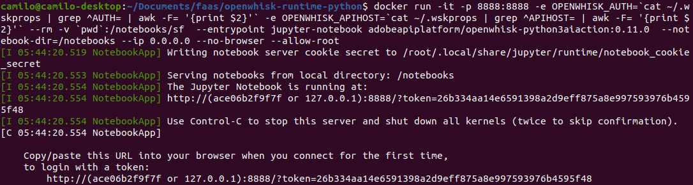
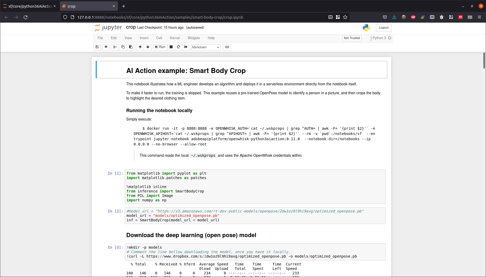
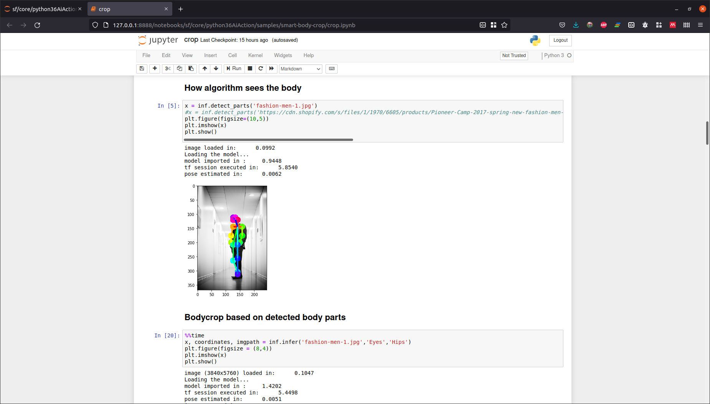

## Python 3 AI Runtime
This action runtime enables developers to create AI Services with OpenWhisk. It comes with preinstalled libraries useful for running machine learning and deep learning inferences. [Read more about this runtime here](./core/python3AiAction).

# Pre-steps

Be sure that you run the previos documentation, so when you run:

```
$ docker images
```

You can see  the repository `whisk/action-python-v3.6-ai`

# AI Action

This image contains libraries and frameworks useful for running AI Services.

Bellow are the versions for the included libraries:

| Image Version | Package | Notes |
| ------------- | ------- | ----- |
| 1.1.0      | Tensorflow 1.11.0, PyTorch 0.4.1 | Based on Ubuntu 16.04.5, Python 3.5.2.

### Opening Notebooks

This image has Jupyter Notebook installed. You may find useful to run quick Notebooks directly on the image which may run the actual code. To start Jupyter Notebook execute:

```bash
docker run -it -p 8888:8888 --rm --entrypoint jupyter-notebook whisk/action-python-v3.6-ai  --notebook-dir=/notebooks --ip 0.0.0.0 --no-browser --allow-root
```

Or

```
docker run -it -p 8888:8888 -e OPENWHISK_AUTH=`cat ~/.wskprops | grep ^AUTH= | awk -F= '{print $2}'` -e OPENWHISK_APIHOST=`cat ~/.wskprops | grep ^APIHOST= | awk -F= '{print $2}'` --rm -v `pwd`:/notebooks/sf  --entrypoint jupyter-notebook adobeapiplatform/openwhisk-python3aiaction:0.11.0  --notebook-dir=/notebooks --ip 0.0.0.0 --no-browser --allow-root
```

After, you can see a message with the URL and token to access in the browser to Jupyter and use all the examples.






(**Warning!** Everytime that you run the docker container, you will go to obtain a new token).



#### AI Action Sample

To view an example with this AI Action check the [samples/smart-body-crop notebook](./samples/smart-body-crop/crop.ipynb) and follow the instructions.

### 1.1.0 Details
#### Available python packages

| Package               | Version               |
| --------------------- | --------------------- |
| tensorboard           | 1.11.0                |
| tensorflow            | 1.11.0                |
| torch                 | 0.4.1                 |
| torchvision           | 0.2.1                 |
| scikit-learn          | 0.19.2                |
| scipy                 | 1.1.0                 |
| sklearn               | 0.0                   |
| numpy                 | 1.15.2                |
| pandas                | 0.23.4                |
| Pillow                | 5.2.0                 |
| Cython                | 0.28.5                |
| ipykernel             | 4.9.0                 |
| ipython               | 6.5.0                 |
| ipywidgets            | 7.4.2                 |
| jupyter               | 1.0.0                 |
| jupyter-client        | 5.2.3                 |
| jupyter-console       | 5.2.0                 |
| jupyter-core          | 4.4.0                 |
| Keras                 | 2.2.2                 |
| Keras-Applications    | 1.0.4                 |
| Keras-Preprocessing   | 1.0.2                 |
| matplotlib            | 3.0.0                 |
| notebook              | 5.7.0                 |
| opencv-contrib-python | 3.4.2.17              |
| protobuf              | 3.6.1                 |

For a complete list execute:

```bash
docker run --rm --entrypoint pip actionloop-python-v3.6-ai list
```

#### Available Ubuntu packages

For a complete list execute:

```bash
docker run --rm --entrypoint apt actionloop-python-v3.6-ai list --installed
```

**Next ->** [OpenFaaS](../openfaas/README.md)